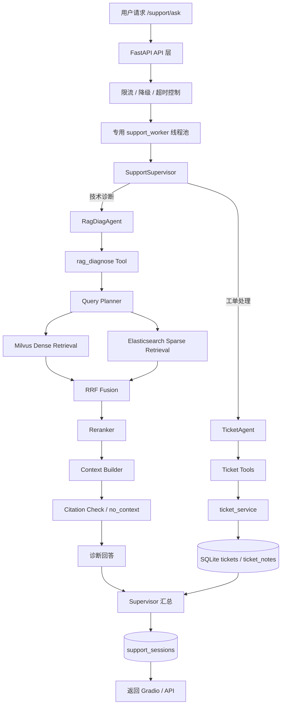
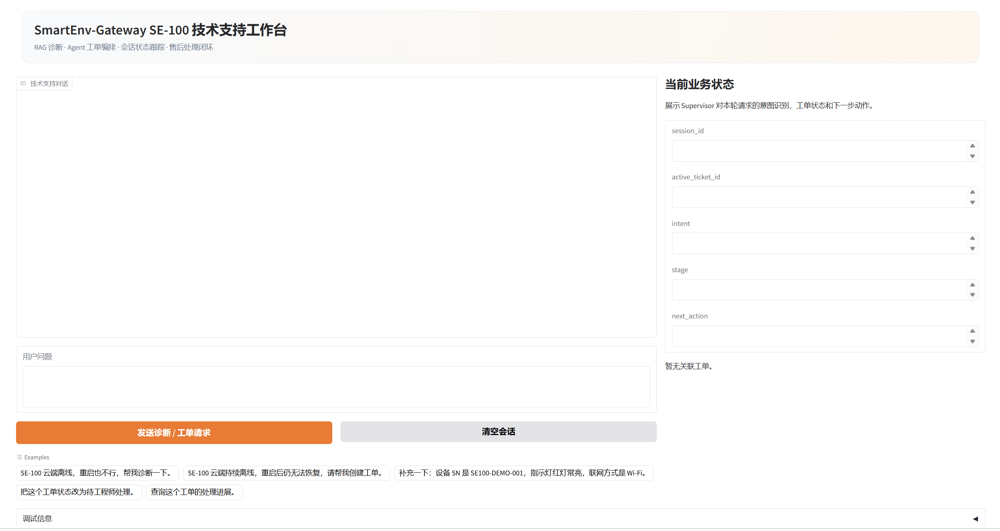
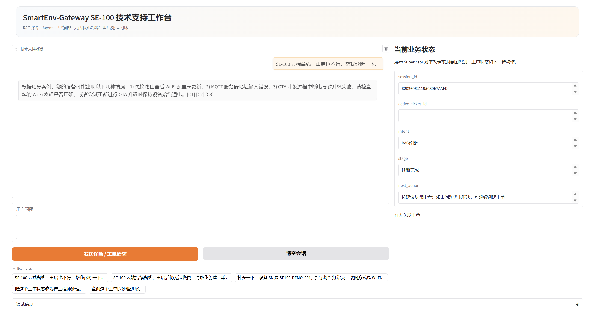
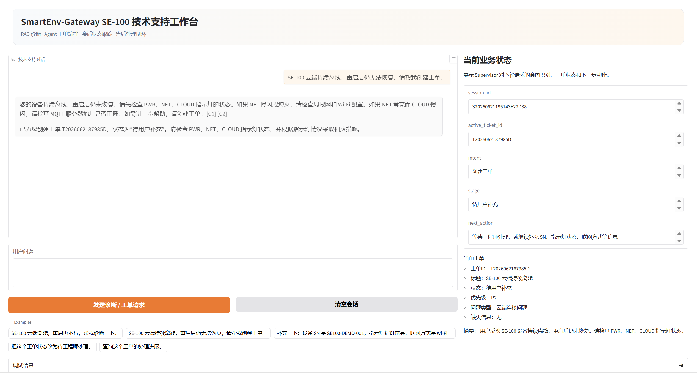
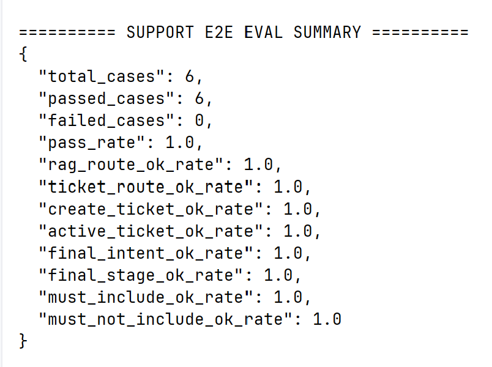
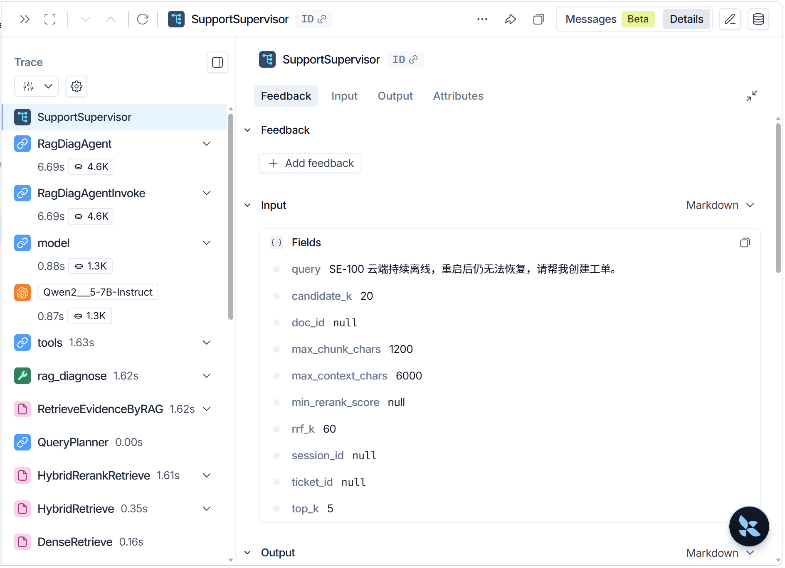

# SmartEnv-Gateway SE-100 技术支持系统

面向智能硬件售后场景的 **RAG + Agent + 工单闭环** 项目。系统围绕虚拟设备 `SmartEnv-Gateway SE-100` 构建，支持基于知识库证据的技术诊断、多轮会话状态维护、售后工单创建/查询/补充/更新、端到端评估与 LangSmith 可观测链路。

本项目不是单轮知识库问答 Demo，而是一个贴近真实售后业务流程的大模型应用工程：用户从“描述设备故障”开始，系统完成知识库检索、证据约束诊断、工单动作编排、Session 状态延续，并通过评估脚本验证主链路稳定性。

---

## 1. 项目定位

在智能硬件售后场景中，用户问题通常不是一次问答就能结束。真实流程往往包括：

1. 用户描述设备故障现象；
2. 系统基于产品知识库给出诊断建议；
3. 需要售后跟进时创建工单；
4. 用户后续继续补充 SN、指示灯、联网方式等信息；
5. 客服或工程师查询、更新工单状态；
6. 系统在多轮对话中持续关联当前工单。

因此，本项目重点解决的不是“让模型回答一个问题”，而是把 **RAG 证据链、Agent 工具调用、业务状态、数据库写入、前端演示和自动化评估** 串成一条可运行、可观测、可验证的应用链路。

---

## 2. 核心能力

| 能力 | 当前实现 |
| --- | --- |
| RAG 证据链 | Query Planner、Milvus 向量召回、Elasticsearch/BM25 关键词召回、RRF Fusion、Reranker、Context Builder、Citation Check、no_context 兜底 |
| Agent 编排 | SupportSupervisor 统一调度，RagDiagAgent 负责诊断表达，TicketAgent 负责工单动作 |
| 工具边界 | Agent 只调用受控 Tool，不直接访问向量库或数据库；Tool 再调用稳定的 Service 层 |
| 工单闭环 | 支持创建工单、查询工单、追加备注、更新状态、终态工单处理 |
| 多轮会话 | SQLite `support_sessions` 维护 `session_id`、`active_ticket_id`、`last_intent`、`stage`、`last_diagnosis` |
| 工程稳定性 | 专用线程池隔离同步主链路、并发限流、压力降级、请求超时、SQLite 写入保护、索引一致性校验 |
| 评估体系 | Retrieval Eval、Answer Eval、Support E2E Eval 三层评估 |
| 可观测性 | LangSmith trace 覆盖 Supervisor、RAG、Agent、Tool、检索与重排节点 |
| 前端演示 | Gradio 技术支持工作台，展示对话、Session、工单、诊断结构和工具调用 |

---

## 3. 回炉优化后的工程改造

本项目在基础 RAG + Agent 链路完成后，针对工程稳定性、可维护性和业务闭环做了回炉优化。README 中重点展示这些改造，是因为它们比“能跑通 Demo”更能体现真实工程能力。

### 3.1 主链路并发隔离与超时控制

`/support/ask` 是系统最重的入口，会触发 RAG 检索、Reranker、LLM、Agent 和工单服务。项目没有把这条同步主链路直接阻塞在 FastAPI 默认执行环境中，而是通过 `app/core/support_runtime.py` 提供专用线程池：

- FastAPI 接口保持 async 入口；
- 重型同步链路进入 `support_worker` 专用线程池；
- 通过 `asyncio.wait_for` 增加请求级超时边界；
- Gradio 侧通过 Future 轮询方式持续向前端输出“处理中”状态。

这样做的目标是：接口层能接住请求，重型链路有独立执行资源，超时请求可以被明确兜底。

### 3.2 并发限流与压力降级

项目通过 `app/core/support_load_guard.py` 对技术支持主链路做并发保护：

- 使用 `BoundedSemaphore` 控制同一时刻进入主链路的请求数；
- 超出并发上限时返回 429，避免请求无限堆积；
- 达到压力阈值后主动降级：降低 `top_k`、`candidate_k`、上下文长度和单 chunk 长度；
- FastAPI 和 Gradio 共用同一套限流与降级逻辑。

这使系统不只是“单人演示可用”，而是具备基本的压力边界意识。

### 3.3 SQLite 写入保护

工单和会话状态都落在 SQLite 中。SQLite 在并发写入下容易出现 `database is locked`。项目在 `ticket_service.py` 中增加统一写入保护入口 `run_sqlite_write`：

- 本进程内写操作通过 `RLock` 串行化；
- SQLite 连接启用 `busy_timeout`；
- 写锁冲突时进行指数退避重试；
- 开启 WAL 模式提升读写并发能力；
- `ticket_service` 和 `support_session_service` 的写操作统一走该入口。

这保证工单创建、备注追加、状态更新和 Session 更新不会散落成不可控写库逻辑。

### 3.4 文档切分策略升级

早期 chunk 只是简单字符切分，容易破坏故障手册、FAQ 和历史工单案例的章节结构。当前 `chunk_service.py` 升级为 **section-aware recursive chunking**：

- 先识别 Markdown 标题、中文章节号、数字标题等章节边界；
- 再在 section 内用 `RecursiveCharacterTextSplitter` 递归切分；
- chunk 元数据保留 `section_title`、`char_start`、`char_end`、`source`；
- 下游检索结果可以追溯到文档、chunk 和章节信息。

这个改造提升了 RAG 证据片段的可解释性，也减少了上下文被硬切碎的问题。

### 3.5 双索引写入与一致性校验

项目同时使用 Milvus 做向量召回、Elasticsearch 做关键词召回。为了避免“Milvus 写成功但 ES 失败”或“重复入库产生脏数据”，`index_service.py` 对入库链路做了工程化处理：

- 入库前可按 `doc_id` 删除旧 chunk；
- 为 Milvus entity 生成稳定主键；
- 写入 Milvus 和 Elasticsearch 后分别统计 chunk 数；
- 对 `expected_chunk_count`、`milvus_count`、`es_count` 做一致性校验；
- 入库失败时清理两侧残留数据；
- 保存 `index_jobs` 状态，支持失败后重新索引。

这让知识库入库不再只是“调用两个数据库 API”，而是具备状态、补偿和一致性检查的工程链路。

### 3.6 Query Planner 与 JSON 输出兜底

RAG 查询前引入 Query Planner，但没有把系统稳定性完全押在大模型输出上：

- 短故障类问题走规则快速规划，减少不必要的 LLM 调用；
- Planner 输出异常或不是 JSON 时回退到原始 query；
- `json_output_service.py` 统一抽取模型返回中的 JSON 对象，兼容 Markdown code block 和前后解释文字；
- Agent 结构化输出失败时也有兜底路径，避免主链路直接崩掉。

这体现的是大模型应用开发中的一个关键原则：**模型输出要参与业务，但不能成为唯一稳定性来源**。

### 3.7 引用校验与 no_context 兜底

技术支持系统不能编造设备事实。项目在 RAG 链路中加入多层证据约束：

- Context Builder 为每个证据片段生成 `C1`、`C2` 等引用编号；
- 生成回答后清理不存在的伪引用；
- 有上下文但回答缺引用时补充最小引用；
- 检索无命中、低相关性过滤后为空、上下文构造为空时统一返回 `no_context`；
- RagDiagAgent 如果没有调用 `rag_diagnose` 工具，结果会被拦截。

目标不是让模型“尽量回答”，而是让系统在证据不足时明确拒绝编造。

### 3.8 工单状态与 Session 细化

工单链路不只创建一条记录，还支持多轮状态延续：

- 创建工单后把 `ticket_id` 写入当前 session 的 `active_ticket_id`；
- 用户后续只说“补充一下……”时，可以自动关联当前工单；
- 没有当前工单时，系统会拒绝凭空追加备注；
- 已解决、已关闭等终态工单不再继续要求用户补充信息；
- 对外返回的工单对象经过压缩，减少前端和接口中的无用字段。

这让系统从“能调用 create_ticket 工具”升级为“能维护一个连续售后流程”。

---

## 4. 系统主链路

统一入口为：

```text
POST /support/ask
```

整体流程如下：



核心分层原则：

- **Supervisor 负责调度**：判断用户意图，决定进入诊断链路还是工单链路；
- **RAG 负责证据**：检索、融合、重排、上下文构造和引用控制；
- **Agent 负责受控决策**：选择工具、组织结构化结果，不直接写数据库；
- **Service 负责业务落库**：执行稳定的工单和 Session 操作；
- **Session 负责多轮状态**：维护当前会话、当前工单和最近诊断。

---

## 5. 技术架构

| 层级 | 主要文件 | 作用 |
| --- | --- | --- |
| API 层 | `app/api/routes_support.py` | `/support/ask` 统一入口，处理限流、降级、超时和异常映射 |
| 并发控制 | `app/core/support_runtime.py`、`app/core/support_load_guard.py` | 专用线程池、请求超时、并发限流、压力降级 |
| 调度层 | `app/services/support_supervisor_service.py` | 意图识别、链路分发、Session 更新、最终响应汇总 |
| RAG Agent | `app/services/rag_diag_agent_service.py` | 基于 `rag_diagnose` 工具组织诊断表达 |
| RAG 链路 | `query_planner_service.py`、`dense_retrieval_service.py`、`sparse_retrieval_service.py`、`hybrid_retrieval_service.py`、`rerank_service.py`、`context_builder_service.py`、`rag_service.py` | 查询规划、混合召回、融合重排、上下文构造、引用校验 |
| 工单 Agent | `app/services/ticket_agent_service.py` | 创建、查询、更新、补充工单的工具调用决策 |
| 工单服务 | `ticket_tool.py`、`ticket_service.py`、`support_session_service.py` | Tool 边界、SQLite 工单写入、Session 状态维护 |
| 索引服务 | `document_service.py`、`chunk_service.py`、`index_service.py` | 文档上传、解析、章节感知切分、Milvus/ES 双写和一致性校验 |
| 数据库 | `app/db/milvus_client.py`、`app/db/elasticsearch_client.py`、SQLite | 向量检索、关键词检索、工单与会话状态存储 |
| 前端 | `app/ui/gradio_support_ui.py` | 技术支持工作台，展示对话、工单、Session、诊断和工具调用 |
| 评估 | `scripts/evaluate_*.py` | 检索评估、答案质量评估、Support E2E 评估 |

---

## 6. RAG 证据链

当前 RAG 链路如下：

1. **Query Planner**：把用户口语化故障描述转成更适合检索的 query；
2. **Dense Retrieval**：通过 Milvus 向量相似度召回语义相关片段；
3. **Sparse Retrieval**：通过 Elasticsearch/BM25 召回包含关键实体、型号、指示灯、错误现象的片段；
4. **RRF Fusion**：融合 dense 与 sparse 两路召回结果；
5. **Reranker**：对候选片段做更精细的相关性排序；
6. **Context Builder**：控制上下文长度，保留 `source`、`chunk_id` 和引用编号；
7. **Citation Check**：校验回答引用是否来自当前 contexts；
8. **no_context**：证据不足时拒绝编造。

这条链路的设计目标是：**让 SE-100 技术诊断尽量基于知识库证据，而不是依赖模型自由发挥**。

---

## 7. Agent 职责边界

项目包含两个业务 Agent 和一个 Supervisor：

### 7.1 SupportSupervisor

负责判断用户当前请求属于：

- RAG 诊断；
- 创建工单；
- 查询工单；
- 追加备注；
- 更新状态；
- 缺少工单编号的补充信息。

Supervisor 不直接访问向量库，也不直接写数据库，只负责任务分发、状态更新和最终结果汇总。

### 7.2 RagDiagAgent

RagDiagAgent 负责把 RAG 证据组织成用户能理解的诊断回答。它必须通过 `rag_diagnose` 工具获取证据，不能绕过 RAG 链路直接编造 SE-100 产品事实。

### 7.3 TicketAgent

TicketAgent 只处理工单动作：

- `create_ticket`：创建工单；
- `get_ticket_detail`：查询工单；
- `add_ticket_note`：追加备注；
- `update_ticket_status`：更新状态。

TicketAgent 不直接写 SQLite。实际数据库操作由 `ticket_service.py` 完成。

---

## 8. 工单与 Session 机制

SQLite 中包含三类核心业务表：

| 表 | 作用 |
| --- | --- |
| `tickets` | 保存工单主体信息，包括标题、问题类型、优先级、状态、摘要、缺失信息等 |
| `ticket_notes` | 保存用户后续补充信息，避免覆盖原始工单内容 |
| `support_sessions` | 保存当前会话状态，包括当前工单、上一轮意图、当前阶段和最近诊断 |

`active_ticket_id` 是多轮工单处理的核心字段。用户创建工单后，系统会把工单 ID 写入当前 Session。后续用户即使不重复提供工单号，只说“补充一下，设备 SN 是……”，系统也可以把补充信息追加到当前工单。

---

## 9. 评估结果

项目提供三层评估：检索评估、答案质量评估和 Support E2E 评估。

### 9.1 检索评估

评估集共 15 条，覆盖产品边界、故障排查、历史工单、配置指导和售后流程。

| Retriever | Hit@1 | Hit@3 | Hit@5 | Recall@5 | MRR@5 |
| --- | ---: | ---: | ---: | ---: | ---: |
| dense | 0.4000 | 0.6000 | 0.8667 | 0.4789 | 0.5344 |
| sparse | 0.6000 | 0.9333 | 0.9333 | 0.5544 | 0.7667 |
| hybrid | 0.6000 | 0.8667 | 0.9333 | 0.5622 | 0.7022 |
| hybrid_rerank | 0.8000 | 0.8667 | 0.9333 | 0.5956 | 0.8356 |

### 9.2 答案质量评估

| 指标 | 结果 |
| --- | ---: |
| 测试用例 | 10 |
| 通过用例 | 10 |
| 通过率 | 100% |
| 引用格式校验 | 100% |
| 引用 ID 有效性 | 100% |
| must_include / must_not_include | 100% |

### 9.3 Support E2E 评估

| 指标 | 结果 |
| --- | ---: |
| 测试用例 | 6 |
| 通过用例 | 6 |
| 通过率 | 100% |
| RAG 路由正确率 | 100% |
| 工单路由正确率 | 100% |
| 创建工单校验 | 100% |
| active_ticket 关联校验 | 100% |
| final_intent / final_stage 校验 | 100% |

E2E 用例覆盖：技术诊断、诊断后创建工单、多轮补充备注、查询当前工单、更新工单为已解决、没有当前工单时拒绝凭空追加备注。

---

## 10. 运行方式

### 10.1 安装依赖

```bash
pip install -r requirements.txt
```

如果使用 GPU 推理，请确认 PyTorch、Embedding 模型和 Reranker 模型环境可用。`requirements-gpu-working.txt` 记录了当前验证过的 GPU 依赖环境。

### 10.2 配置环境变量

复制环境变量示例：

```bash
cp .env.example .env
```

Windows 可以直接复制 `.env.example` 并重命名为 `.env`。

核心配置包括：

```text
LLM_BASE_URL=本地 LLM 服务地址
LLM_API_KEY=本地 LLM API Key
LLM_MODEL=模型名称

MILVUS_URI=Milvus 服务地址
MILVUS_COLLECTION_DOCS=Milvus collection 名称
MILVUS_VECTOR_DIM=向量维度

ES_URL=Elasticsearch 服务地址
ES_INDEX_NAME=Elasticsearch 索引名称

EMBEDDING_MODEL_PATH=Embedding 模型本地路径
EMBEDDING_DEVICE=cpu 或 cuda

RERANKER_MODEL_PATH=Reranker 模型本地路径
RERANKER_DEVICE=cpu 或 cuda

LANGSMITH_TRACING=true 或 false
LANGSMITH_API_KEY=LangSmith API Key
LANGSMITH_PROJECT=LangSmith 项目名

ENABLE_STARTUP_WARMUP=true 或 false
```

可选工程参数：

```text
SUPPORT_MAX_CONCURRENT_REQUESTS=4
SUPPORT_DEGRADE_CONCURRENT_REQUESTS=3
SUPPORT_WORKER_THREADS=4
SUPPORT_REQUEST_TIMEOUT=150

SQLITE_BUSY_TIMEOUT_MS=5000
SQLITE_WRITE_MAX_RETRIES=3
SQLITE_WRITE_RETRY_BASE_SECONDS=0.05
```

`.env` 包含本地路径和密钥，不应提交到公开仓库。

### 10.3 启动服务

CMD：

```bash
set PYTHONPATH=%CD%
uvicorn app.main:app --reload --host 127.0.0.1 --port 8000
```

PowerShell：

```powershell
$env:PYTHONPATH = (Get-Location)
uvicorn app.main:app --reload --host 127.0.0.1 --port 8000
```

核心入口：

```text
POST http://127.0.0.1:8000/support/ask
```

Gradio 工作台：

```text
http://127.0.0.1:8000/ui
```

---

## 11. 常用接口

| 接口 | 方法 | 作用 |
| --- | --- | --- |
| `/health` | GET | 健康检查 |
| `/documents/upload` | POST | 上传文档 |
| `/documents` | GET | 查看已上传文档 |
| `/documents/ingest` | POST | 解析文档 |
| `/documents/chunk` | POST | 切分文档 |
| `/documents/index` | POST | 文档入库到 Milvus 和 Elasticsearch |
| `/embeddings/document` | POST | 对文档 chunk 生成 embedding |
| `/chat/query` | POST | 基础 RAG 问答入口 |
| `/agent/rag-diagnose` | POST | 单独调试 RAG 诊断 Agent |
| `/agent/ticket` | POST | 单独调试工单 Agent |
| `/support/ask` | POST | 技术支持主链路入口 |
| `/ui` | GET | Gradio 技术支持工作台 |

---

## 12. 运行评估

检索评估：

```bash
python scripts/evaluate_retrieval.py --top-k 5
```

答案质量评估：

```bash
python scripts/evaluate_rag_answers.py
```

Support E2E 评估：

```bash
python scripts/evaluate_support_e2e.py
```

Windows 一键检查：

```bash
scripts/check_all.cmd
```

`evaluate_support_e2e.py` 需要先启动 FastAPI 服务，因为它会通过 `/support/ask` 验证完整业务链路。

---

## 13. 项目目录结构

```text
SmartEnv-Gateway SE-100 技术支持系统
├── app
│   ├── api
│   │   ├── routes_support.py          # 技术支持主入口 /support/ask
│   │   ├── routes_documents.py        # 文档上传、解析、切分、入库
│   │   ├── routes_agent.py            # Agent 调试接口
│   │   ├── routes_chat.py             # 基础 RAG 问答接口
│   │   ├── routes_embeddings.py       # embedding 接口
│   │   └── routes_health.py           # 健康检查
│   │
│   ├── core
│   │   ├── support_runtime.py         # 专用线程池与超时控制
│   │   └── support_load_guard.py      # 并发限流与压力降级
│   │
│   ├── db
│   │   ├── milvus_client.py           # Milvus 向量库连接、写入、检索
│   │   └── elasticsearch_client.py    # Elasticsearch 索引、写入、BM25 检索
│   │
│   ├── services
│   │   ├── support_supervisor_service.py      # 主调度器
│   │   ├── rag_diag_agent_service.py          # RAG 诊断 Agent
│   │   ├── rag_diag_tool.py                   # rag_diagnose 工具
│   │   ├── rag_service.py                     # RAG 主链路
│   │   ├── query_planner_service.py           # 查询规划
│   │   ├── dense_retrieval_service.py         # 向量召回
│   │   ├── sparse_retrieval_service.py        # BM25 召回
│   │   ├── hybrid_retrieval_service.py        # RRF 融合
│   │   ├── rerank_service.py                  # 重排序
│   │   ├── context_builder_service.py         # 上下文构造
│   │   ├── ticket_agent_service.py            # 工单 Agent
│   │   ├── ticket_tool.py                     # 工单工具
│   │   ├── ticket_service.py                  # 工单数据库服务
│   │   ├── support_session_service.py         # Session 状态服务
│   │   ├── chunk_service.py                   # 章节感知文档切分
│   │   ├── index_service.py                   # 双索引入库和一致性校验
│   │   ├── json_output_service.py             # JSON 结构化输出清洗
│   │   └── warmup_service.py                  # 启动预热
│   │
│   ├── ui
│   │   └── gradio_support_ui.py       # Gradio 技术支持工作台
│   │
│   └── main.py                        # FastAPI 应用入口
│
├── data
│   ├── demo_docs                      # SE-100 示例知识库文档
│   ├── eval                           # 检索、答案、E2E 评估集与结果
│   ├── processed                      # 本地处理中间产物，公开仓库只保留 .gitkeep
│   ├── uploads                        # 本地上传文件，公开仓库只保留 .gitkeep
│   └── tickets.db                     # 本地工单库，公开仓库不提交
│
├── docs/images                        # 演示截图、评估截图、LangSmith Trace 截图
├── scripts                            # 环境检查与评估脚本
├── .env.example                       # 环境变量示例
├── requirements.txt                   # Python 依赖
├── requirements-gpu-working.txt       # 已验证 GPU 环境依赖记录
└── README.md
```

---

## 14. 演示截图

截图统一放置在 `docs/images/`：

| 文件 | 内容 |
| --- | --- |
| `gradio_support_ui.png` | Gradio 技术支持工作台 |
| `rag_diagnosis_result.png` | RAG 技术诊断结果 |
| `ticket_create_result.png` | 工单创建结果 |
| `session_ticket_note_result.png` | 多轮工单补充结果 |
| `retrieval_eval_result.png` | 检索评估结果 |
| `answer_eval_result.png` | 答案质量评估结果 |
| `support_e2e_eval_result.png` | Support E2E 评估结果 |
| `langsmith_trace.png` | LangSmith 链路追踪截图 |

示例：











---

## 15. 仓库提交边界

公开 GitHub 仓库建议提交：

- `app/` 核心代码；
- `scripts/` 检查与评估脚本；
- `data/demo_docs/` 示例知识库；
- `data/eval/` 评估集和评估结果；
- `docs/images/` 演示截图；
- `.env.example`、`.gitignore`、`requirements.txt`、`requirements-gpu-working.txt`、`README.md`。

不建议提交：

- `.env`；
- `__pycache__/`；
- `.idea/`、`.vscode/`；
- `data/tickets.db`；
- `data/uploads/*`；
- `data/processed/*` 的本地中间产物；
- `logs/*`；
- 本地模型文件和大体积数据库目录。

`.gitignore` 已覆盖这些本地运行产物。正式上传前建议重新复制一份项目，只保留公开仓库需要展示和复现的内容。
